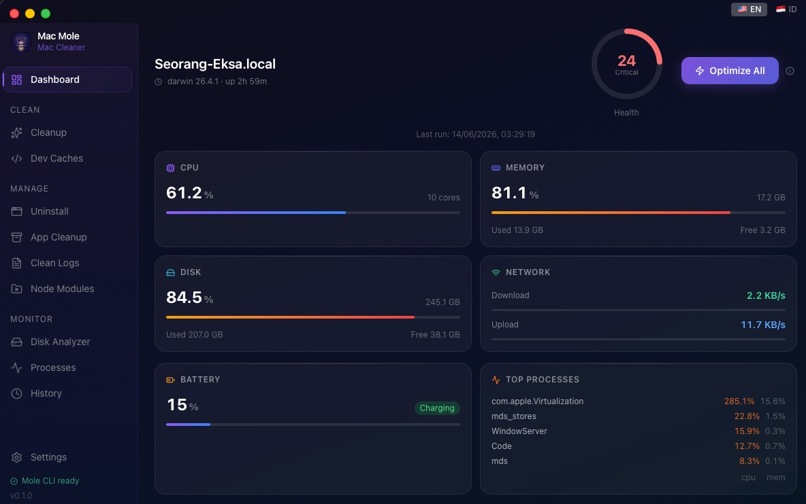
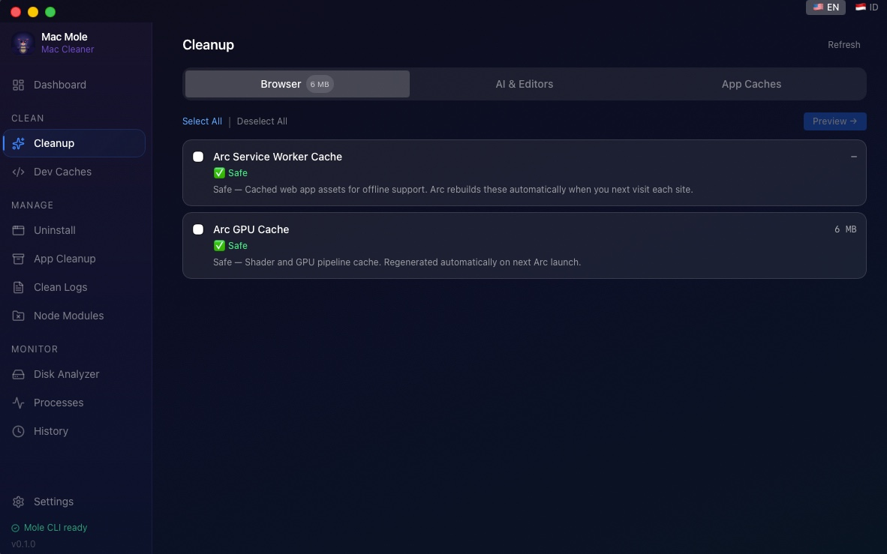
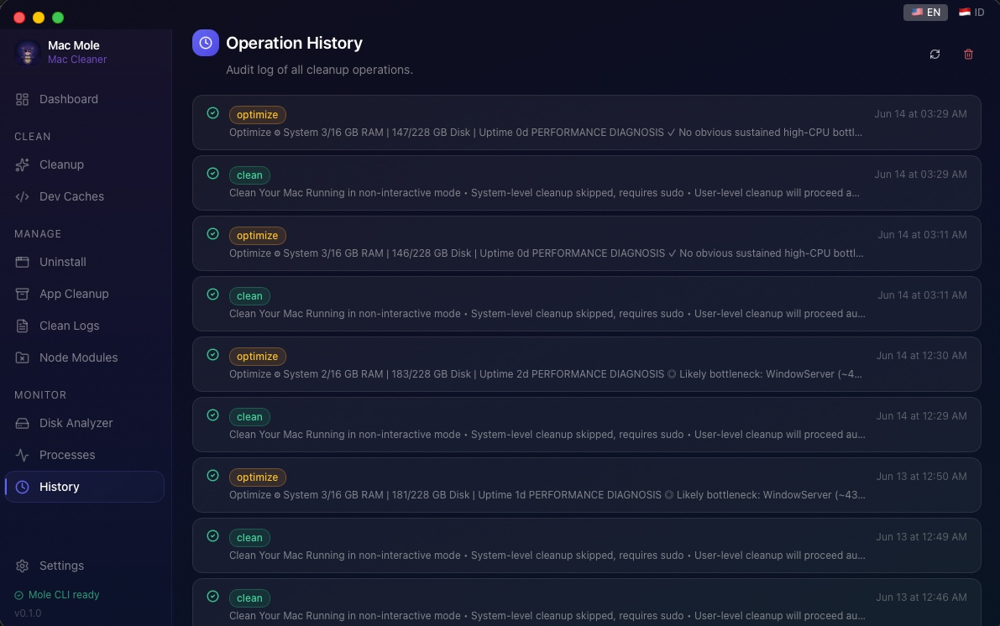
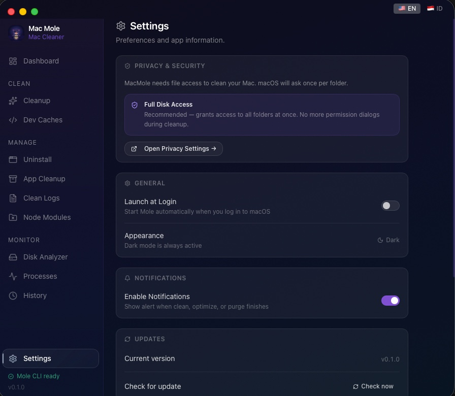

<div align="center">
  
  <h1>MacMole</h1>
  <p><em>Deep clean and optimize your Mac — CLI &amp; native Desktop app.</em></p>
</div>

<p align="center">
  <a href="https://github.com/eksant/MacMole/releases"></a>
  <a href="LICENSE"></a>
  <a href="https://github.com/tw93/Mole"></a>
  <a href="https://github.com/eksant/MacMole/commits"></a>
</p>

> **Fork of [tw93/Mole](https://github.com/tw93/Mole)** — this repository extends the original Mole CLI with a native macOS Desktop application built with [Wails v2](https://wails.io) + React.

<p align="center">
  
</p>

## Desktop App

A native macOS desktop application that wraps the Mole CLI in a clean, modern UI — real-time system metrics, one-click clean/optimize, menu-bar icon, and more.

**Desktop App** — this repository root is the desktop app source. Run `wails build` to build.

### Dashboard

Real-time system overview — CPU, RAM, Disk, Network, and Battery health score at a glance. One-click **Optimize All** button runs clean + optimize in sequence.



### Cleanup

Browser, AI tool, and app cache cleanup in one place. Each target shows estimated size, safety badge, and requires confirmation before any deletion.



### History

Full log of every clean, optimize, and purge operation — timestamps, output, and status for every run.



### Settings

Privacy & Security redirect, launch-at-login toggle, notifications, update checker, and app info. Full Disk Access guide built-in.



| Feature | Detail |
|---------|--------|
| Real-time Dashboard | CPU, RAM, Disk, Network, Battery with health score |
| Top Processes | Live CPU & memory usage per process |
| Deep Cleaner | `mo clean` with live output stream |
| System Optimizer | 5-step optimization with dry-run preview |
| Deep Purge | `mo purge` for orphaned project artifacts |
| App Cleanup | Remove app-specific caches and leftovers |
| App Uninstaller | Remove apps + all hidden remnants by size |
| Node Modules | Scan and purge unused `node_modules` directories |
| Clean Logs | Remove system and app log files |
| Installer Cleanup | Remove .pkg/.dmg/.zip installer leftovers |
| Disk Analyzer | Visual disk usage breakdown by directory |
| Optimize All | One-click clean + optimize from Dashboard |
| Menu Bar Icon | Runs silently in menu bar, close = hide |
| Notifications | macOS alerts when tasks complete |
| Launch at Login | Auto-start on macOS login |
| Update Checker | Check latest release from GitHub |

---

## Features

- **All-in-one toolkit**: Combines CleanMyMac, AppCleaner, DaisyDisk, and iStat Menus in a **single binary**
- **Deep cleaning**: Removes caches, logs, and browser leftovers to **reclaim gigabytes of space**
- **Smart uninstaller**: Removes apps plus launch agents, preferences, and **hidden remnants**
- **Disk insights**: Visualizes usage, finds large files, **rebuilds caches**, and refreshes system services
- **Live monitoring**: Shows real-time CPU, GPU, memory, disk, and network stats

## Quick Start

**Desktop App**

Download the latest `.dmg` from the [Releases](https://github.com/eksant/MacMole/releases) page, open it, and drag MacMole to your Applications folder.

**Or build from source**

```bash
git clone https://github.com/eksant/MacMole.git
cd MacMole
wails build
open build/bin/MacMole.app
```

**CLI (Mole)**

Install the bundled Mole CLI via Homebrew:

```bash
brew install mole
```

Or via script:

```bash
curl -fsSL https://raw.githubusercontent.com/tw93/mole/main/install.sh | bash
```

> Note: MacMole is macOS-only. The desktop app requires macOS 10.13+.

**CLI commands**

```bash
mo                           # Interactive menu
mo clean                     # Deep cleanup
mo uninstall                 # Remove apps + leftovers
mo optimize                  # Refresh caches & services
mo analyze                   # Visual disk explorer
mo status                    # Live system health dashboard
mo purge                     # Clean project build artifacts
mo installer                 # Find and remove installer files

mo touchid                   # Configure Touch ID for sudo
mo completion                # Set up shell tab completion
mo update                    # Update Mole CLI
mo remove                    # Remove Mole CLI from system
mo --help                    # Show help
mo --version                 # Show installed version
```

**Preview safely**

```bash
mo clean --dry-run
mo uninstall --dry-run
mo purge --dry-run

# Also works with: optimize, installer, remove, completion, touchid enable
mo clean --dry-run --debug   # Preview + detailed logs
mo optimize --whitelist      # Manage protected optimization rules
mo clean --whitelist         # Manage protected caches
mo purge --paths             # Configure project scan directories
mo analyze /Volumes          # Analyze external drives only
```

## Security & Safety Design

Mole is a local system maintenance tool, and some commands can perform destructive local operations.

Mole uses safety-first defaults: path validation, protected-directory rules, conservative cleanup boundaries, and explicit confirmation for higher-risk actions. When risk or uncertainty is high, Mole skips, refuses, or requires stronger confirmation rather than broadening deletion scope.

`mo analyze` is safer for ad hoc cleanup because it moves files to Trash through Finder instead of deleting them directly.

Review [SECURITY.md](mole/SECURITY.md) and [SECURITY_AUDIT.md](mole/SECURITY_AUDIT.md) for reporting guidance, safety boundaries, and current limitations.

## Tips

- Video tutorial: Watch the [Mole tutorial video](https://www.youtube.com/watch?v=UEe9-w4CcQ0), thanks to PAPAYA 電腦教室.
- Safety and logs: `clean`, `uninstall`, `purge`, `installer`, and `remove` are destructive. Review with `--dry-run` first, and add `--debug` when needed. File operations are logged to `~/Library/Logs/mole/operations.log`. Disable with `MO_NO_OPLOG=1`. Review [SECURITY.md](mole/SECURITY.md) and [SECURITY_AUDIT.md](mole/SECURITY_AUDIT.md).
- Navigation: Mole supports arrow keys and Vim bindings `h/j/k/l`.

## Features in Detail

### Deep System Cleanup

```bash
$ mo clean

Scanning cache directories...

  ✓ User app cache                                           45.2GB
  ✓ Browser cache (Chrome, Safari, Firefox)                  10.5GB
  ✓ Developer tools (Xcode, Node.js, npm)                    23.3GB
  ✓ System logs and temp files                                3.8GB
  ✓ App-specific cache (Spotify, Dropbox, Slack)              8.4GB
  ✓ Trash                                                    12.3GB

====================================================================
Space freed: 95.5GB | Free space now: 223.5GB
====================================================================
```

Note: In `mo clean` -> Developer tools, Mole removes unused CoreSimulator `Volumes/Cryptex` entries and skips `IN_USE` items.

### Smart App Uninstaller

```bash
$ mo uninstall

Select Apps to Remove
═══════════════════════════
▶ ☑ Photoshop 2024            (4.2G) | Old
  ☐ IntelliJ IDEA             (2.8G) | Recent
  ☐ Premiere Pro              (3.4G) | Recent

Uninstalling: Photoshop 2024

  ✓ Removed application
  ✓ Cleaned 52 related files across 12 locations
    - Application Support, Caches, Preferences
    - Logs, WebKit storage, Cookies
    - Extensions, Plugins, Launch daemons

====================================================================
Space freed: 12.8GB
====================================================================
```

### System Optimization

```bash
$ mo optimize

System: 5/32 GB RAM | 333/460 GB Disk (72%) | Uptime 6d

  ✓ Rebuild system databases and clear caches
  ✓ Reset network services
  ✓ Refresh Finder and Dock
  ✓ Clean diagnostic and crash logs
  ✓ Remove swap files and restart dynamic pager
  ✓ Rebuild launch services and spotlight index

====================================================================
System optimization completed
====================================================================

Use `mo optimize --whitelist` to exclude specific optimizations.
```

### Disk Space Analyzer

> Note: By default, Mole skips external drives under `/Volumes` for faster startup. To inspect them, run `mo analyze /Volumes` or a specific mount path.

```bash
$ mo analyze

Analyze Disk  ~/Documents  |  Total: 156.8GB

 ▶  1. ███████████████████  48.2%  |  📁 Library                     75.4GB  >6mo
    2. ██████████░░░░░░░░░  22.1%  |  📁 Downloads                   34.6GB
    3. ████░░░░░░░░░░░░░░░  14.3%  |  📁 Movies                      22.4GB
    4. ███░░░░░░░░░░░░░░░░  10.8%  |  📁 Documents                   16.9GB
    5. ██░░░░░░░░░░░░░░░░░   5.2%  |  📄 backup_2023.zip              8.2GB

  ↑↓←→ Navigate  |  O Open  |  F Show  |  ⌫ Delete  |  L Large files  |  Q Quit
```

### Live System Status

Real-time dashboard with health score, hardware info, and performance metrics.

```bash
$ mo status

Mole Status  Health ● 92  MacBook Pro · M4 Pro · 32GB · macOS 14.5

⚙ CPU                                    ▦ Memory
Total   ████████████░░░░░░░  45.2%       Used    ███████████░░░░░░░  58.4%
Load    0.82 / 1.05 / 1.23 (8 cores)     Total   14.2 / 24.0 GB
Core 1  ███████████████░░░░  78.3%       Free    ████████░░░░░░░░░░  41.6%
Core 2  ████████████░░░░░░░  62.1%       Avail   9.8 GB

▤ Disk                                   ⚡ Power
Used    █████████████░░░░░░  67.2%       Level   ██████████████████  100%
Free    156.3 GB                         Status  Charged
Read    ▮▯▯▯▯  2.1 MB/s                  Health  Normal · 423 cycles
Write   ▮▮▮▯▯  18.3 MB/s                 Temp    58°C · 1200 RPM

⇅ Network                                ▶ Processes
Down    ▁▁█▂▁▁▁▁▁▁▁▁▇▆▅▂  0.54 MB/s      Code       ▮▮▮▮▯  42.1%
Up      ▄▄▄▃▃▃▄▆▆▇█▁▁▁▁▁  0.02 MB/s      Chrome     ▮▮▮▯▯  28.3%
Proxy   HTTP · 192.168.1.100             Terminal   ▮▯▯▯▯  12.5%
```

Health score is based on CPU, memory, disk, temperature, and I/O load, with color-coded ranges.

Shortcuts: In `mo status`, press `k` to toggle the cat and save the preference, and `q` to quit.

#### Machine-Readable Output

Both `mo analyze` and `mo status` support a `--json` flag for scripting and automation.

`mo status` also auto-detects when its output is piped (not a terminal) and switches to JSON automatically.

```bash
# Disk analysis as JSON
$ mo analyze --json ~/Documents
{
  "path": "/Users/you/Documents",
  "entries": [
    { "name": "Library", "path": "...", "size": 80939438080, "is_dir": true },
    ...
  ],
  "total_size": 168393441280,
  "total_files": 42187
}

# System status as JSON
$ mo status --json
{
  "host": "MacBook-Pro",
  "health_score": 92,
  "cpu": { "usage": 45.2, "logical_cpu": 8, ... },
  "memory": { "total": 25769803776, "used": 15049334784, "used_percent": 58.4 },
  "disks": [ ... ],
  "uptime": "3d 12h 45m",
  ...
}

# Auto-detected JSON when piped
$ mo status | jq '.health_score'
92
```

### Project Artifact Purge

Clean old build artifacts such as `node_modules`, `target`, `build`, and `dist` to free up disk space.

```bash
mo purge

Select Categories to Clean - 18.5GB (8 selected)

➤ ● my-react-app       3.2GB | node_modules
  ● old-project        2.8GB | node_modules
  ● rust-app           4.1GB | target
  ● next-blog          1.9GB | node_modules
  ○ current-work       856MB | node_modules  | Recent
  ● django-api         2.3GB | venv
  ● vue-dashboard      1.7GB | node_modules
  ● backend-service    2.5GB | node_modules
```

> Note: We recommend installing `fd` on macOS.
> `brew install fd`

> Safety: This permanently deletes selected artifacts. Review carefully before confirming. Projects newer than 7 days are marked and unselected by default.

<details>
<summary><strong>Custom Scan Paths</strong></summary>

Run `mo purge --paths` to configure scan directories, or edit `~/.config/mole/purge_paths` directly:

```shell
~/Documents/MyProjects
~/Work/ClientA
~/Work/ClientB
```

When custom paths are configured, Mole scans only those directories. Otherwise, it uses defaults like `~/Projects`, `~/GitHub`, and `~/dev`.

</details>

### Installer Cleanup

Find and remove large installer files across Downloads, Desktop, Homebrew caches, iCloud, and Mail. Each file is labeled by source.

```bash
mo installer

Select Installers to Remove - 3.8GB (5 selected)

➤ ● Photoshop_2024.dmg     1.2GB | Downloads
  ● IntelliJ_IDEA.dmg       850.6MB | Downloads
  ● Illustrator_Setup.pkg   920.4MB | Downloads
  ● PyCharm_Pro.dmg         640.5MB | Homebrew
  ● Acrobat_Reader.dmg      220.4MB | Downloads
  ○ AppCode_Legacy.zip      410.6MB | Downloads
```

## Quick Launchers

Launch Mole commands from Raycast or Alfred:

```bash
curl -fsSL https://raw.githubusercontent.com/tw93/Mole/main/scripts/setup-quick-launchers.sh | bash
```

Adds 5 commands: `Mole Clean`, `Mole Uninstall`, `Mole Optimize`, `Mole Analyze`, `Mole Status`.

### Raycast Setup

After running the script, complete these steps in Raycast:

1. Open Raycast Settings (⌘ + ,)
2. Go to **Extensions** → **Script Commands**
3. Click **"Add Script Directory"** (or **"+"**)
4. Add path: `~/Library/Application Support/Raycast/script-commands`
5. Search in Raycast for: **"Reload Script Directories"** and run it
6. Done! Search for `Mole Clean` or `clean`, `Mole Optimize`, or `Mole Status` to use the commands

> **Note**: The script creates the commands, but Raycast still requires a one-time manual script directory setup.

### Terminal Detection

Mole auto-detects your terminal app. iTerm2 has known compatibility issues. We highly recommend [Kaku](https://github.com/tw93/Kaku). Other good options are Alacritty, kitty, WezTerm, Ghostty, and Warp. To override, set `MO_LAUNCHER_APP=<name>`.

## Community Love

Thanks to everyone who helped build Mole. Go follow them. ❤️

<a href="https://github.com/tw93/Mole/graphs/contributors">
  
</a>

<br/><br/>
Real feedback from users who shared Mole on X.


## Support

- If Mole helped you, star the repo or [share it](https://twitter.com/intent/tweet?url=https://github.com/tw93/Mole&text=Mole%20-%20Deep%20clean%20and%20optimize%20your%20Mac.) with friends.
- Got ideas or bugs? Read the [Contributing Guide](mole/CONTRIBUTING.md) and open an issue or PR.
- Like Mole? <a href="https://miaoyan.app/cats.html?name=Mole" target="_blank">Buy Tw93 a Coke</a> to support the project. 🥤 Supporters are below.

<a href="https://miaoyan.app/cats.html?name=Mole"></a>

## License

**Dual license:**

- **`mole/` directory** (upstream Mole CLI) — [MIT License](LICENSE), copyright tw93.
- **Everything else** (MacMole Desktop — Go/Wails backend, React frontend, assets) — **Non-Commercial License**, copyright eksant.

Free for personal, educational, and internal use. Commercial use requires prior written permission. See [LICENSE](LICENSE) for full terms or contact eksant@gmail.com.

- Original Mole CLI — © 2025 [tw93](https://github.com/tw93) · [tw93/Mole](https://github.com/tw93/Mole)
- MacMole Desktop — © 2025 [eksant](https://github.com/eksant) · [eksant/MacMole](https://github.com/eksant/MacMole)
